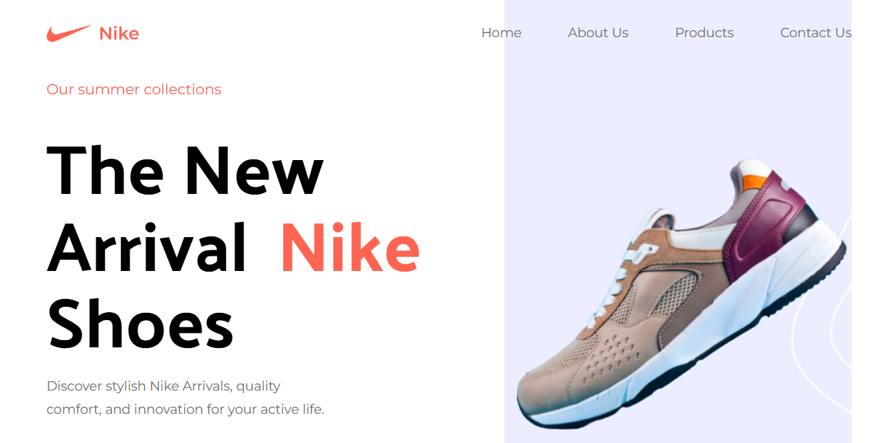

# **Nike Landing Page – React + Vite + TailwindCSS**  

🚀 A **modern and stylish Nike landing page** built using **React, Vite, and TailwindCSS**. This project showcases a sleek UI/UX with a fully responsive design, smooth animations, and optimized performance.  

## ✨ **Features**  

- **📱 Fully Responsive** – Works seamlessly on all devices.  
- **🎨 Modern UI/UX** – Inspired by Nike’s sleek and premium branding.  
- **⚡ High Performance** – Powered by Vite for fast loading times.  
- **🛠️ TailwindCSS Styling** – Easily customizable design.  
- **🎥 Smooth Animations** – Engaging transitions and hover effects.  

## 🖼️ **Preview**  

  
  

## 🛠 **Tech Stack**  

- **React** – Component-based frontend development.  
- **Vite** – Superfast and optimized build tool.  
- **TailwindCSS** – Utility-first CSS for modern styling.  


## 📦 **Getting Started**  

1️⃣ **Clone the repository:**  
```sh
git clone https://github.com/bader-ben/Nike.git
```  

2️⃣ **Navigate to the project directory:**  
```sh
cd nike-landing-page
```  

3️⃣ **Install dependencies:**  
```sh
npm install
```  

4️⃣ **Start the development server:**  
```sh
npm run dev
```  

5️⃣ **Open your browser and visit:**  
```sh
http://localhost:5173/
```  

## 🎨 **Customization**  

- Modify **TailwindCSS styles** to change colors, fonts, or layout.  
- Update **images and text** to feature different products or branding.  
- Integrate **e-commerce functionalities** if needed.  

## 🛠 **Contributing**  

Contributions are welcome! Feel free to fork the repository, submit pull requests, or report issues.  

## 📜 **License**  

This project is licensed under the **MIT License** – free to use and modify.  

